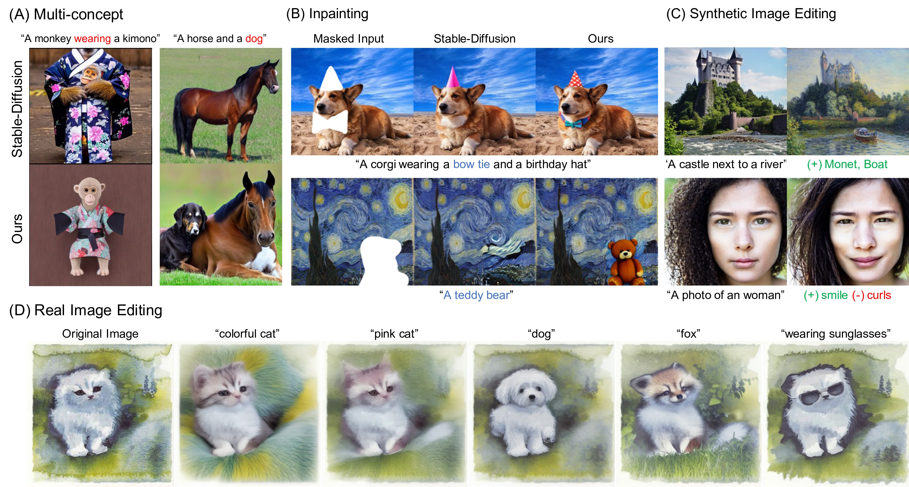
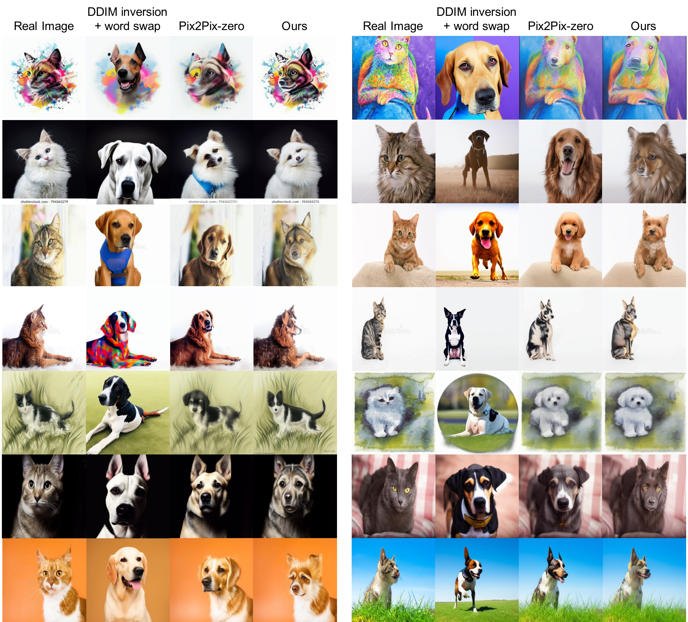
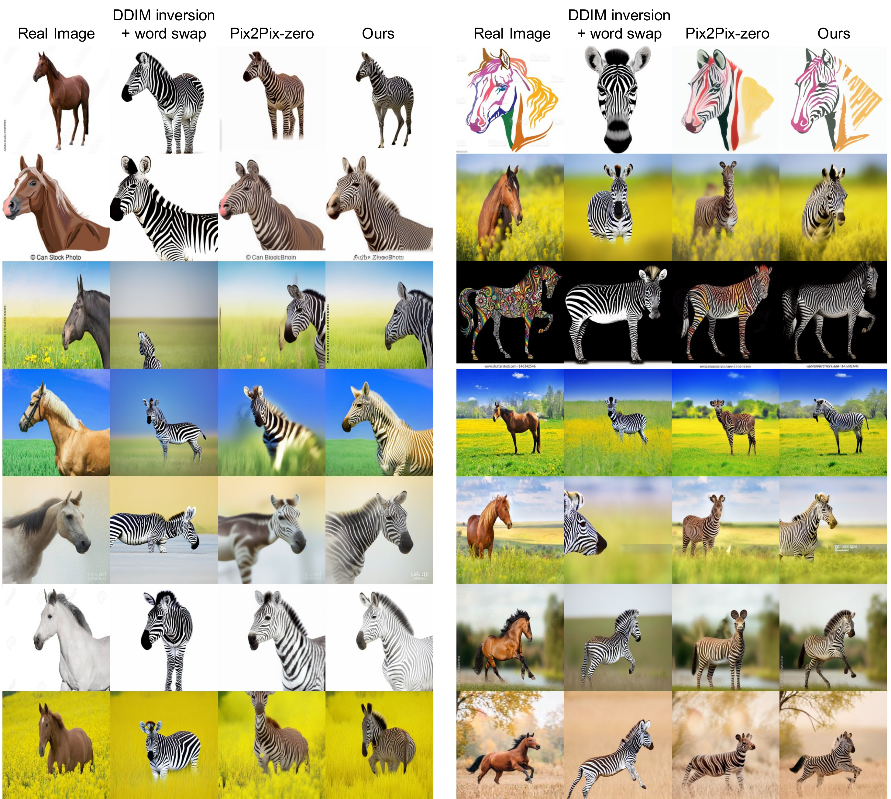

# Energy-Based Cross Attention for Bayesian Context Update in Text-to-Image Diffusion Models

## Abstract
Despite the remarkable performance of text-to-image diffusion models in image generation tasks, recent studies have raised the issue that generated images sometimes cannot capture the intended semantic contents of the text prompts, which phenomenon is often called semantic misalignment. 
To address this, here we present a novel energy-based model (EBM) framework. 
Specifically, we first formulate EBMs of latent image representations and text embeddings in each cross-attention layer of the denoising autoencoder. 
Then, we obtain the gradient of the log posterior of context vectors, which can be updated and transferred to the subsequent cross-attention layer, thereby implicitly minimizing a nested hierarchy of energy functions. 
Our latent EBMs further allow zero-shot compositional generation as a linear combination of cross-attention outputs from different contexts. Using extensive experiments, we demonstrate that the proposed method is highly effective in handling various image generation tasks, including multi-concept generation, text-guided image inpainting, and real and synthetic image editing.



## Upcoming 

Latest update: 20 June, 2023

- [x] Code release
- [ ] Colab demo
- [ ] Project page


## Prerequisites
- python 3.9
- [diffusers](https://github.com/huggingface/diffusers) 0.16.1
- pytorch 2.0.1
- CUDA 11.7

It is okay to use lower version of CUDA with proper pytorch version. We highly recommend to use a conda environment as below.

## Getting started
### 1. Clone the repository
```
git clone https://github.com/jeongsol-kim/energy-attention.git
cd energy_attention
```

### 2. Set environment
```
conda env create --name EBCA --file simple_env.yaml
conda activate EBCA
```

## Main tasks
### Overview
This repo follows the style of [diffusers](https://github.com/huggingface/diffusers). Specifically, the core `modules` are consists of `modules/models`, `modules/pipelines`, and `modules/utils`.

- `models`: This is a self-contained folder for
  ```python
  class EnergyUNet2DConditionModel(UNet2DConditionModel)
  ```
  which replaces cross-attention in ```UNet2DConditionModel``` with the proposed Energy-based Cross-attention (EBCA).

- `pipelines`: Each pipeline corresponds to a specific task, e.g. `energy_realedit_stable_diffusion.py` for real-image editing. The denoiser uses `EnergyUNet2DConditionModel` as their neural architecture. `Stable_diffusion_repaint.py` pipeline is included for inheritance and comes from [diffusers/examples/community](https://github.com/huggingface/diffusers/blob/main/examples/community/stable_diffusion_repaint.py)
- `utils`:
  - `attention_hook.py`: contains hook functions for monitoring the progress of energy values.
  - `gamma_scheduler.py`: contains generalized schedulers for hyperparameters in BCU, CACAO, etc.
 
We provide four exemplary main scripts, i.e `realedit_txt2img.py`. These scripts may share some common options as follow: 
- `--gamma_attn, --gamma_norm`: $\gamma_{attn}, \gamma_{norm}$ in BCU.
- `--gamma_tau`: $\tau$ in learning rate scheduling (either for both main and editorial contexts. Please see appendix C for more details).
- `--alpha`: $\alpha_{s}$ in CACAO. `--alpha_tau` is similar to `gamma_tau`. Usually both $\tau$ are set in same value.
- `--debug`: The results and configurations are saved in [weight & biases](https://wandb.ai/site) if you are not debugging. Set this option if you don't want w&b logging.

More details per each task are provided in below. 


### 1. Real-image editing
**_Cat &rarr; Dog_**
```
python realedit_txt2img.py --gamma_attn 0. --gamma_norm 0. --img_file assets/samples/realedit/cat_1.jpg \
--editing_prompt dog cat --editing_direction 1 0 --alpha 0.75 0.65 --alpha_tau 0.5 0.5 --gamma_attn_compose 0.0006 0.0005 --gamma_norm_compose 0.0006 0.0005 --gamma_tau 0.5 0.5
```

**_Horse &rarr; Zebra_**
```
python realedit_txt2img.py --gamma_attn 0. --gamma_norm 0. --img_file assets/samples/realedit/horse_1.jpg \
--editing_prompt "zebra" "brown horse" --editing_direction 1 0 --alpha 0.6 0.5 --alpha_tau 0.3 0.3 --gamma_attn_compose 0.0005 0.0004 --gamma_norm_compose 0.0005 0.0004 --gamma_tau 0.3 0.3
```

**_AFHQ_**
```
python realedit_txt2img.py --img_file assets/samples/realedit/afhq_1.jpg --editing_prompt "a goat, a photography of a goat" \
--alpha 0.6 --alpha_tau 0.35 --gamma_attn_compose 0.001 --gamma_norm_compose 0.001 --gamma_tau 0.3 --editing_direction 1 --seed 0
```

- BCU is not applied to the main prompt for the sake of img-to-img translation (more discussions in appendix C).
- `--editing_direction` implies whether the `--editing_prompt`, e.g. _dog, cat_, corresponds to conjunction (1) or negation (0) composition. 
- Recommend to set `--gamma_{attn, norm}_compose` in a scale of $1e-4$.
- While the hyper-parameters, e.g. $\gamma, \alpha$, are set in common for every images, each hyper-parameter can be individually fine-tuned for a better performance. For example, smaller `--alpha_tau` leads to more drastic changes as CACAO starts to be applied from early time steps.  





### 2. Synthetic-image editing
**_Stylization_**
```
python synedit_txt2img.py --gamma_attn 0. --gamma_norm 0. --prompt "a house at a lake" --editing_prompt "Water colors, Watercolor painting, Watercolor" \
--alpha 1.1 --alpha_tau 0.2 --seed 12 --gamma_attn_compose 0.0004 --gamma_norm_compose 0.0004 --gamma_tau 0.2
```

**_Editing_**
```
python synedit_txt2img.py --gamma_attn 0.01 --gamma_norm 0.01 --prompt "a castle next to a river" --seed 48 \\
--editing_prompt "monet painting, impression, sunrise" "boat on a river, boat" --editing_direction 1 1 \\
--alpha 1.3 1.3 --alpha_tau 0.2 0.2 --gamma_attn_compose 0. 0. --gamma_norm_compose 0. 0. --gamma_tau 0. 0.
```
- `--editing_direction` implies whether the `--editing_prompt`, e.g. _monet, boat_, corresponds to conjunction (1) or negation (0) composition.
- We refer some of the prompt examples from [SEGA: Instructing Diffusion using Semantic Dimensions.](https://github.com/ml-research/semantic-image-editing)
- While BCU is not applied to editorial prompts in this example, i.e. `--gamma_{attn, norm}_compose=0`, they can be also readily applied to editorial prompts as well. Here, BCU is applied to the main prompt in contrast to the real-image editing, i.e. img-to-img translation, to preserve the intended semantic contents of main prompts, _a castle next to a river_.


### 3. Multi-concept generation
```
python inference_txt2img.py --prompt "A lion with a crown" --gamma_attn 0.01 --gamma_norm 0.02 --seed 1
```
- We recommend to use $\gamma_{attn}, \gamma_{attn} \in \{0.01, 0.02\}$.
- Also, we recommend to use `--token_indices` and `--token_upweight` for token-wise step size tuning, i.e. $\gamma_{attn, s}$, given a $s$-th token. For example,
```
python inference_txt2img.py --prompt "A cat wearing a shirt" --gamma_attn 0.01 --gamma_norm 0.02 --seed 1 --token_upweight 2.5 --token_indices 5
```

### 4. Text-guided inpainting
```
python inpaint_txt2img.py --gamma_attn 0.025 --gamma_norm 0.025 --prompt "teddy bear" --img_file assets/samples/inpaint/starry_night_512.png --mask_file assets/samples/inpaint/starry_night_512_mask.png
```
- We recommend to use $\gamma_{attn}, \gamma_{attn} \in \{0.01, 0.025\}$.
- [Stable Inpaint](https://huggingface.co/runwayml/stable-diffusion-inpainting) is a default backbone model. It can be switched to a [Stable Repaint](https://github.com/huggingface/diffusers/blob/main/examples/community/stable_diffusion_repaint.py) with `--repaint` option.

